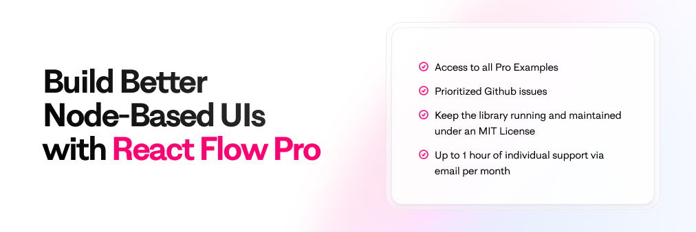

# xyflow/web

This monorepo contains our team website and the docs for our libraries.

- [xyflow.com](https://xyflow.com) - our team website and blog
- [reactflow.dev](https://reactflow.dev) - the website and documentation for the React Flow library
- [svelteflow.dev](https://svelteflow.dev) - the website and documentation for the Svelte Flow library

## What's inside?

We're using [Turborepo](https://turbo.build/repo) to manage this monorepo because
there's a lot going on.

### apps/

The apps directory contains projects that run on the backend or applications we
might want to run during development:

- `apps/example-apps` contains all of our examples and tutorials for ReactFlow and SvelteFlow.
- `apps/ui-components` houses all of the components for [React Flow Components](https://reactflow.dev/components).

### packages/

The packages in this monorepo are reusable self-contained bits that we want to
share across our apps and websites. Much of it is configuration for the different
tools we use:

- `packages/eslint-config-xyflow`
- `packages/xy-tailwind-config`
- `packages/xy-tsconfig`
- `packages/xy-ui` is a React component library that contains any components that
  we want to share across our websites. The package encompasses everything from
  page layouts, UI building blocks, and complex widgets. We often use
  [Shadcn](https://ui.shadcn.com) when looking to add new components, and we style
  everything with [Tailwind](https://tailwindcss.com).

### sites/

Each directory in the sites folder is a separate website that we deploy. The name
of the directory always corresponds to the domain name of the website:

- `sites/reactflow.dev` is the documentation site for React Flow. It, and the
  rest of sites, are built with [Nextra](https://nextra.site/) and
  [Next.js](https://nextjs.org/).
- `sites/svelteflow.dev` is the documentation for our newest library, Svelte Flow.
- `sites/xyflow.com` is the new home page for our organization. It contains our
  blog and some information on how we approach open source development.

## Getting started

To run any of the websites locally, you'll first need to install the dependencies
and packages. We recommend using [pnpm](https://pnpm.io/) to manage your dependencies.

```sh
pnpm install
```

If you take a peek in `package.json` you'll see we have a few different scripts
to run our apps. If you just want to run everything at once, you can just do:

```sh
pnpm run dev
```

To run the two documentation sites you can use:

```sh
pnpm run dev:docs
```

For everything else, there is an individual script to run each app independently:

- `pnpm run dev:reactflow.dev`
- `pnpm run dev:svelteflow.dev`
- `pnpm run dev:xyflow.com`
- `pnpm run dev:style`

### Displaying Showcase Projects

We have a database of projects that use our libraries stored in notion. Both the
React Flow and Svelte Flow sites are fetching this data at build time using `getStaticProps`. You need to have a `.env.local` file with a `NOTION_API_SECRET` to make this work locally. Otherwise, placeholder showcases are shown.

### Update React Flow and Svelte Flow dependencies

There is a Github action that checks the latest React Flow and Svelte Flow versions
daily and creates a PR if there is a new version.

---

## Support our work with React Flow Pro

React Flow and Svelte Flow are open-source MIT-licensed libraries, and it will
be forever. Our libraries enable thousands of solo developers and organizations
like Stripe and Linkedin to build their node-based apps. With so many active
users, it takes time and effort to maintain the library, docs, and community.
We can’t do that without your support.

[](https://reactflow.dev/pro)

Why Subscribe? With your subscription, you are ensuring the sustainable
maintenance and development of both React Flow and Svelte Flow. This is how we
make sure these libraries stay MIT-licensed. In return, you get high-quality,
maintained, updated libraries, along with benefits like direct support,
prioritized feature requests, and access to our Pro Examples.

---

## Contact us

We're happy to try and answer any questions you have about our libraries. We're
also always excited when folks want to share their projects with us. There are
a few ways you can get in touch:

- Use the contact form on our [website](https://xyflow.com/contact).
- Drop us an email at [info@xyflow.com](mailto:info@xyflow.com)
- Join our [Discord server](https://discord.com/invite/RVmnytFmGW)
