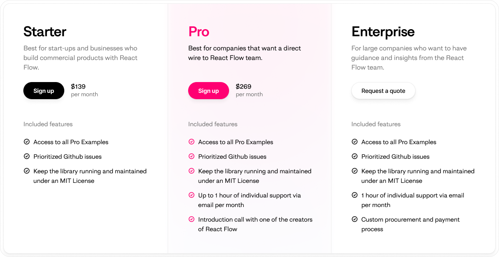

# xyflow/web

This monorepo contains everything needed to build and run the xyflow website,
the documentation sites for Svelte Flow and React Flow, and our pro subscriber
platform.

Our documentation has always been open source, but now our pro platform is too!
We hope that other open-source organisations can learn or use it as a starting
point if they want to build their own paid subscription platform.

## What's inside?

We're using [Turborepo](https://turbo.build/repo) to manage this monorepo because
there's a lot going on.

### apps/

The apps directory contains projects that run on the backend or applications we
might want to run during development:

- `apps/nhost-backend` is the backend we use to power our pro platform. It handles
  user authentication, subscription management, and email. [Nhost](https://nhost.io)
  is the open-source serverless backend we use to power it.
- `apps/svelte-examples` is a SvelteKit app that contains all the examples we use
  throughout our Svelte docs. We like to use [sandpack](https://sandpack.codesandbox.io)
  for our React examples but it doesn't support Svelte yet, so we built our own
  example viewer!
- `apps/xy-styleguide` is a a [Storybook](https://storybook.js.org/) app that
  tries to document and demo all the components in our `packages/xy-ui` package.

### packages/

The packages in this monorepo are reusable self-contained bits that we want to
share across our apps and websites. Much of it is configuration for the different
tools we use:

- `packages/eslint-config-xyflow`
- `packages/xy-tailwind-config`
- `packages/xy-tsconfig`
- `packages/xy-ui` is a React component library that contains any components that
  we want to share across our websites. The package encompasses everything from
  page layouts, UI building blocks, and complex widgets. We use often use
  [Shadcn](https://ui.shadcn.com) when looking to add new components, and we style
  everything with [Tailwind](https://tailwindcss.com).

### sites/

Each directory in the sites folder is a separate website that we deploy. The name
of the directory always corresponds to the domain name of the website:

- `sites/pro.xyflow.com` is the frontend for our pro platform.
- `sites/reactflow.dev` is the documentation site for React Flow. It, and the
  rest of sites, are built with [Nextra](https://nextra.site/) and
  [Next.js](https://nextjs.org/).
- `sites/svelteflow.dev` is the documentation for our newest library, Svelte Flow.
- `sites/xyflow.com` is the new home page for our organization. It contains our
  blog and some information on how we approach open source development.

## Getting started

To run any of the websites locally, you'll first need to install the dependencies
and packages. We recommend using [pnpm](https://pnpm.io/) to manage your dependencies.

```sh
pnpm install
```

If you take a peek in `package.json` you'll see we have a few different scripts
to run our apps. If you just want to run everything at once, you can just do:

```sh
pnpm run dev
```

To run the two documentation sites you can use:

```sh
pnpm run dev:docs
```

For everything else, there is an individual script to run each app independently:

- `pnpm run dev:pro.xyflow.com`
- `pnpm run dev:reactflow.dev`
- `pnpm run dev:svelteflow.dev`
- `pnpm run dev:xyflow.com`
- `pnpm run dev:style`
- `pnpm run dev:nhost`

### Generating showcases

We have a database of projects that use our libraries stored in notion. Both the
React Flow and Svelte Flow sites have a script that will generate the JSON used
to populate those showcases that you will need to run if you change or update the
showcases in notion.

Navigate into either `sites/reactflow.dev` or `sites/svelteflow.dev` and run:

```sh
pnpm write-showcases
```

> [!IMPORTANT]  
> You must have a `.env` file in the project with a key called `NOTION_API_SECRET`
> for this script to work.

## Branches and CD

We have continuous deployment set up on both the `main` and `staging` branches.
Commits to `main` will be deployed to production. Commits to `staging` will be
deployed to a preview environment we have set up on Vercel:

- https://xyflow-platform-staging.vercel.app (our pro platform)
- https://xyflow-website-staging.vercel.app
- https://reactflow-website-staging.vercel.app
- https://svelteflow-website-staging.vercel.app

---

## Support our work with React Flow Pro

Everything with do at xyflow is open-sourced MIT-licensed software, and it will
be forever. Our library enables thousands of solo developers and organizations
like Stripe and Linkedin to build their node-based apps. With so many active
users, it takes time and effort to maintain the library, docs, and community.
We can’t do that without your support.

[](https://pro.reactflow.dev/pricing)

Why Subscribe? With your subscription, you are ensuring the sustainable
maintenance and development of both React Flow and Svelte Flow. This is how we
make sure these libraries stay MIT-licensed. In return, you get a high-quality,
maintained, updated library, along with benefits like direct support,
prioritized feature requests, and access to our Pro Examples.

---

## Contact us

We're happy to try and answer any questions you have about our libraries. We're
also always excited when folks want to share their projects with us. There are
a few ways you can get in touch:

- Use the contact form on our [website](https://xyflow.com/contact).
- Drop us an email at [info@reactflow.dev](mailto:info@reactflow.dev)
- Join our [Discord server](https://discord.com/invite/RVmnytFmGW)
